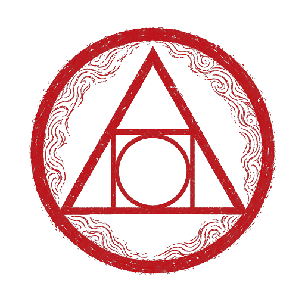
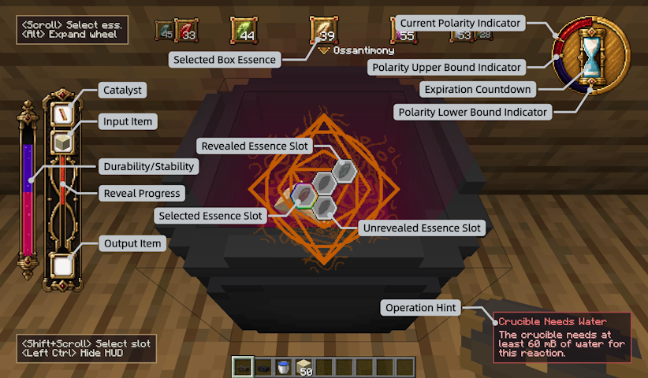

  

# Ars Transmutatoria (Chaos Alchemy)
[简体中文 README](doc/zh_cn/README.md)

Ars Transmutatoria is a Minecraft mod centered around alchemy. Use transmutation scrolls to discover recipes and create items through alchemical reactions.

## Core Gameplay

The mod adds 12 essences with relationships such as restraint and symbiosis. Each essence has four states: Nigredo, normal, Albedo, and Citrinitas.

For each crafting recipe, you must use alchemical reactions to deduce the items in its transmutation chain. Every item has a unique recipe, and recipes can change randomly over time. Essence reactions increase entropy; the higher a scroll's entropy, the faster its durability is consumed.

Once a recipe has been unlocked, you can use the corresponding essences to produce its result. Study the reaction results and derive each recipe in as few steps as possible.

## Credits

Created by **linngdu664** and **zx1316**. Licensed under the [GNU GPLv3](LICENSE.txt).
