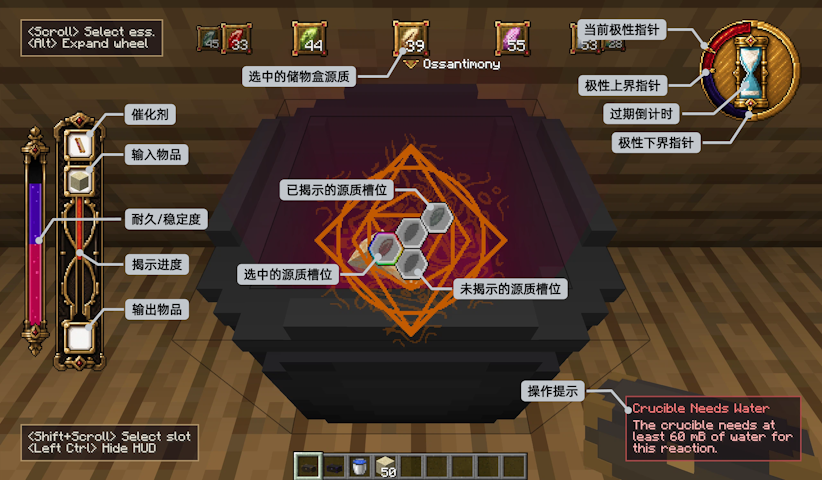

  

# Ars Transmutatoria（混沌炼金）
[English README](../../README.md)

这是一个以炼金术为主题的 Minecraft 模组。可以通过卷轴炼金合成物品。

## 核心玩法
添加了12种源质，源质之间存在克制/共生等关系。并且每个源质存在黑化/常态/白化/黄化共4种状态
对于每个合成配方，需要通过炼金反应来猜合成链上的物品。每个物品生成的配方都不一样，并且配方会随着时间随机变化。源质反应会增加熵值，熵值越高卷轴耐久消耗越快。
配方解锁后就可以使用对应的源质生产成品。
玩家需要根据反应结果，用最少的步数推导出配方。

## 制作人员

由 **linngdu664** 与 **zx1316** 制作。采用 [GNU GPLv3](../../LICENSE.txt) 许可证。
