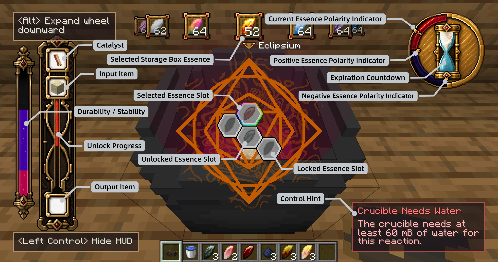
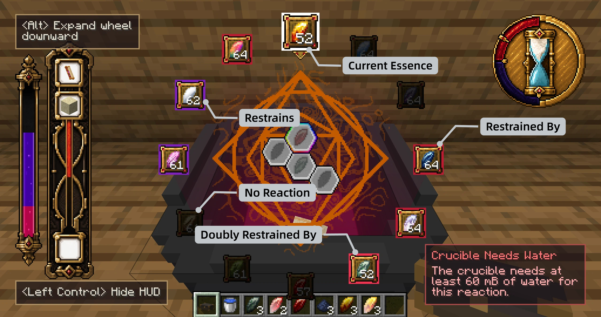

# Advanced Alchemy - Part I

<color=#941400>By this you will obtain the glory of the whole world, and all darkness will flee from you;</color>

<color=#941400>This is the force of all forces and the strength of all strength;</color>

## Overview

In the first three chapters, you mastered obtaining essence metals, their relationships, and manual reactions. Starting from this chapter, you will use **transmutation scrolls** - the core tools of an alchemist - to **replicate** and **transform** all things with the power of essences.

## Scroll Overview

Scrolls are divided into two types:

- **Transmutation Sigil Scroll**: used for **Alchemical Replication** - using one item as a template to replicate a new copy in the crucible.
- **Transmutation Equation Scroll**: used for **Alchemical Transformation** - transforming one item into another.

<row>
<item id="transmutatoria:transmutation_sigil_scroll"/>
<item id="transmutatoria:transmutation_equation_scroll"/>
</row>

Each has five tiers:

| Tier | Durability | Expiration Rule |
|------|------|----------|
| Transmutation | 48 | Every noon |
| Terrestrial | 120 | Every noon |
| Lunar | 300 | Every 8 days (new moon midnight) |
| Solar | 750 | Never expires |
| Void | Never breaks | Never expires |

Advanced scrolls require more resources to craft, but provide higher durability and more lenient expiration rules.

<row>
<item id="transmutatoria:transmutation_sigil_scroll"/>
<item id="transmutatoria:terrestrial_sigil_scroll"/>
<item id="transmutatoria:lunar_sigil_scroll"/>
<item id="transmutatoria:solar_sigil_scroll"/>
<item id="transmutatoria:void_sigil_scroll"/>
</row>

<row>
<item id="transmutatoria:transmutation_equation_scroll"/>
<item id="transmutatoria:terrestrial_equation_scroll"/>
<item id="transmutatoria:lunar_equation_scroll"/>
<item id="transmutatoria:solar_equation_scroll"/>
<item id="transmutatoria:void_equation_scroll"/>
</row>

## Crafting and Activation

### Crafting

The basic recipes for the two scrolls are almost the same - any essence metal, Transmutation Crystal, paper, and gold nugget. The only difference is that the Sigil Scroll requires glowstone dust, while the Equation Scroll requires redstone dust.

<row>
<item id="transmutatoria:eclipsium"/>
<item id="transmutatoria:transmutation_crystal"/>
<item id="minecraft:paper"/>
<item id="minecraft:gold_nugget"/>
<item id="minecraft:glowstone_dust"/>
<item id="minecraft:redstone"/>
</row>

### Activation

A newly crafted scroll is blank and must be activated by placing in a target item:

1. **Right-click while holding the scroll** to open the scroll interface.
2. Place the target item:
   - **Sigil Scroll**: place the **item you want to replicate** in the right slot.
   - **Equation Scroll**: place the **input material you want to transform** in the left slot.
3. If the item has a corresponding alchemy recipe, the item is consumed and the scroll is activated.

::: warning Note
After activation, the placed item cannot be taken out. Be sure to confirm carefully when placing an item.
:::

After activation, the scroll interface changes: it shows a preview of the item on the other side of the recipe, as well as a ring of **essence marks** - showing the required quantity and types of essences. At first, all of them show `?`, and must be revealed one by one through reactions.

These essences correspond to the scroll's **essence slots** - each slot is bound to one target essence and arranged in a connected hexagonal layout. After you put the scroll into the crucible, the HUD center displays the complete essence slot diagram.

Every recipe has a **level**. The higher the level, the more essences are required. Lower-level recipes are suitable for early practice.

## Using It in the Crucible

<row>
<item id="transmutatoria:transmutation_crucible"/>
</row>

### HUD Overview

- **Item bar on the left**: Shows the catalyst, input item, and output item from top to bottom. The purple bar beside it represents scroll durability and current stability, while the red bar shows essence-slot unlock progress.
- **Essence slot diagram in the center**: A colored border marks the selected essence slot. Unlocked slots reveal their target essence, while locked slots remain gray. Hold Shift and scroll the mouse wheel to change the selected slot.
- **Essence wheel at the top**: Appears while holding a storage box and shows its currently selected essence. Scroll the mouse wheel to change essences, then right-click the crucible to insert one. Hold Alt to expand the full wheel and inspect essence relationships.
- **Dial in the upper right**: The outer indicator shows the crucible's current polarity. The two inner indicators mark the positive and negative limits allowed by the recipe. The hourglass displays the scroll's expiration countdown.
- **Control hint in the lower right**: Explains why the reaction cannot proceed, such as missing water, a catalyst, or an input item.

### Storage Box Essence Wheel

When you hold a storage box and look at a crucible, its essence wheel appears at the top of the HUD. The enlarged item frame at the top is the **current essence**. Scroll the mouse wheel to change it; right-clicking the crucible takes one of that essence from the storage box and inserts it into the currently selected essence slot.

Hold **Alt** to expand the wheel downward and show how every other essence relates to the current essence. In the image, “Restrains” means that the current essence restrains that essence, while “Restrained By” means that the current essence is restrained by it. Double-restraint relationships have their own borders as well. Essences with no reaction are dimmed. Release Alt to collapse the wheel and restore a clear view of the crucible.

### Operation Steps

1. **Put in the scroll**: Drop the activated scroll into the crucible, entering the catalyst slot. The HUD center immediately displays the scroll's essence slot diagram, and the left side immediately displays the scroll durability bar.
2. **Put in the input**: Drop the item shown in the **left slot** after scroll activation into the crucible, entering the input slot. If the Sigil Scroll's left side is empty (replication from nothing), skip this step.
3. **Fill essences**: Hold a storage box and right-click the crucible to put essence metals into the currently selected essence slot one by one. Use the mouse wheel to switch the storage box's currently selected essence, and **Shift + mouse wheel** to switch the crucible's currently selected slot.
4. **Wait for the reaction**: After all essence slots are filled, the reaction starts automatically.
5. **Take the product**: After the reaction ends, right-click the crucible to take the product from the output slot.

### Essence Slots and Annihilation

In the scroll's essence slot diagram, each slot has a **target essence** (hidden at first). You need to find out which essence each slot requires through attempts:

- If the filled essence is **the same as the target essence**: the filled essence **annihilates**, the target essence is revealed, and the scroll loses a small amount of durability.
- If the filled essence is **different from the target essence**: the filled essence reacts with the target essence. The filled essence changes state according to the restraint and symbiosis rules, while the target essence is "virtual" - its state change is reflected as a change to the crucible's **polarity**. By observing the state change of the filled essence, you can infer the identity of the target essence.

**Only when all slots are fully annihilated** will the output slot produce the final item. If annihilation is incomplete, the reaction fails - the filled essences remain in the slots as their post-reaction states. You can take them out and try again.

---

After completing your first alchemical synthesis, you may have noticed: sometimes annihilation consumes especially large amounts of scroll durability, and sometimes no output appears even when everything clearly annihilated. The next chapter explains the mechanisms behind these phenomena - entropy, the polarity window, and scroll expiration.
