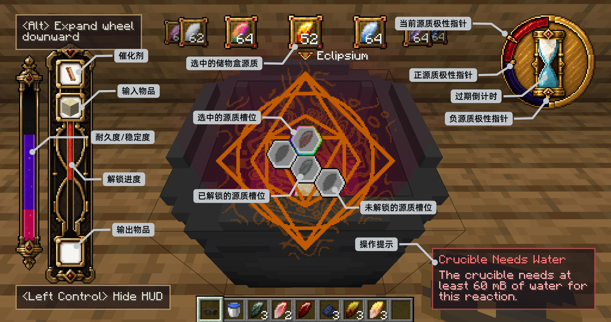
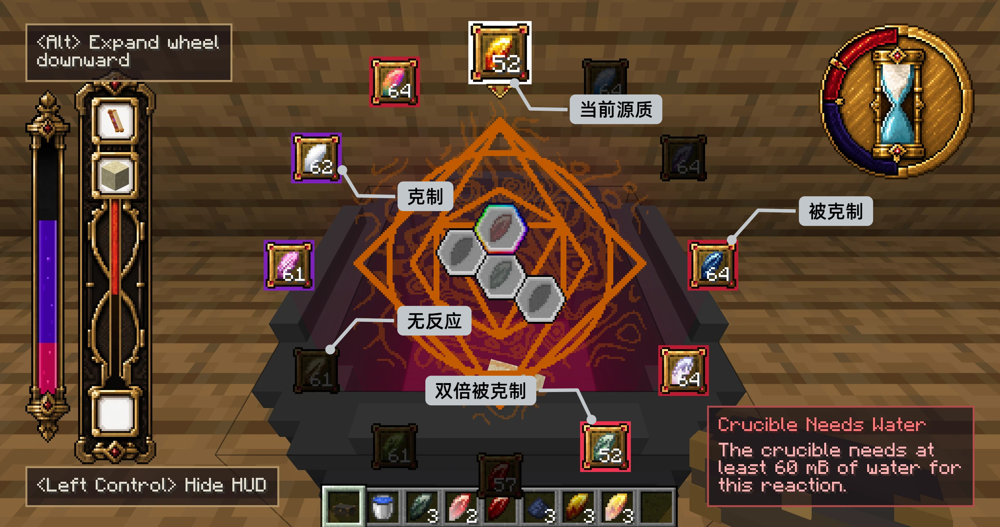

# 进阶炼金 · 上

<color=#941400>以此你将获得全世界荣耀，远离所有黑暗；</color>

<color=#941400>这便是万力之力和无穷之力；</color>

## 概述

前三章你掌握了源质金属的获取、关系和手动反应。从本章开始，你将使用**嬗变卷轴**——炼金术士的核心工具，借助源质的力量**复制**和**转化**世间万物。

## 卷轴概述

卷轴分为两种类型：

- **嬗变印记卷**：用于**炼金复制**——以一件物品为模板，在炼金锅中复制出一份新的。
- **嬗变方程卷**：用于**炼金转化**——将一种物品转化为另一种。

<row>
<item id="transmutatoria:transmutation_sigil_scroll"/>
<item id="transmutatoria:transmutation_equation_scroll"/>
</row>

各有五个等级：

| 等级 | 耐久   | 过期规则 |
|------|------|----------|
| 嬗变 | 48   | 每天正午 |
| 地相 | 120  | 每天正午 |
| 月相 | 300  | 每 8 天（新月午夜） |
| 日相 | 750  | 永不过期 |
| 无相 | 永不损坏 | 永不过期 |

高级卷轴需要更多资源制作，但提供更高的耐久和更宽松的过期规则。

<row>
<item id="transmutatoria:transmutation_sigil_scroll"/>
<item id="transmutatoria:terrestrial_sigil_scroll"/>
<item id="transmutatoria:lunar_sigil_scroll"/>
<item id="transmutatoria:solar_sigil_scroll"/>
<item id="transmutatoria:void_sigil_scroll"/>
</row>

<row>
<item id="transmutatoria:transmutation_equation_scroll"/>
<item id="transmutatoria:terrestrial_equation_scroll"/>
<item id="transmutatoria:lunar_equation_scroll"/>
<item id="transmutatoria:solar_equation_scroll"/>
<item id="transmutatoria:void_equation_scroll"/>
</row>

## 制作与激活

### 合成

两种卷轴的基础配方几乎相同——任意源质金属、嬗变结晶、纸、金粒。唯一的区别是印记卷需要萤石粉，而方程卷需要红石粉。

<row>
<item id="transmutatoria:eclipsium"/>
<item id="transmutatoria:transmutation_crystal"/>
<item id="minecraft:paper"/>
<item id="minecraft:gold_nugget"/>
<item id="minecraft:glowstone_dust"/>
<item id="minecraft:redstone"/>
</row>

### 激活

新制作的卷轴是空白的，需要放入一个目标物品来激活：

1. **手持卷轴右键**打开卷轴界面。
2. 放入目标物品：
   - **印记卷**：在右侧槽位放入**想复制的物品**。
   - **方程卷**：在左侧槽位放入**想转化的原料**。
3. 如果该物品存在对应的炼金配方，物品被消耗，卷轴激活。

::: warning 注意
激活后，放入的物品不可被取出。放入物品时务必仔细确认。
:::

激活后，卷轴界面会发生变化：显示配方另一端的物品预览，以及一组排列成环形的**源质标记**——展示需要的源质数量和类型，初始全部显示为 `?`，需要通过反应逐一揭示。

这些源质对应着卷轴的**源质槽位**——每个槽位绑定一种目标源质，排列成连通的六边形布局。将卷轴投入炼金锅后，HUD 中央会显示完整的源质槽位图。

每个配方都有**等级**。等级越高，需要的源质越多。等级较低的配方适合初期上手练习。

## 在炼金锅中使用

<row>
<item id="transmutatoria:transmutation_crucible"/>
</row>

### HUD 总览

- **左侧物品栏**：从上到下依次显示催化剂、输入物品和输出物品。旁边的紫色长条表示卷轴的耐久度与当前稳定度，红色长条表示源质槽位的解锁进度。
- **中央槽位图**：彩色边框标出当前选中的源质槽位。已解锁槽位会显示目标源质，未解锁槽位则保持灰色；按住 Shift 滚动鼠标滚轮可以切换选中槽位。
- **顶部源质轮盘**：手持储物盒时显示当前选中的源质。滚动鼠标滚轮切换源质，右键炼金锅即可投入；按住 Alt 可展开完整轮盘并查看源质关系。
- **右上角表盘**：外侧指针表示锅的当前极性，两个内侧指针表示配方允许的正、负极性边界。沙漏用于显示卷轴的过期倒计时。
- **右下角操作提示**：当反应暂时无法继续时说明原因，例如缺少水、催化剂或输入物品。

### 储物盒源质轮盘

手持储物盒并看向炼金锅时，HUD 顶部会显示源质轮盘。轮盘顶部放大的物品框表示**当前源质**；滚动鼠标滚轮可以切换，右键炼金锅会从储物盒中取出 1 个当前源质并投入当前选中的源质槽位。

按住 **Alt** 会将轮盘向下展开，并以当前源质为基准显示它与其他源质的关系。图中的“克制”表示当前源质克制该源质，“被克制”表示当前源质受该源质克制；双倍克制关系也会使用独立边框标出。没有反应关系的源质会被压暗。松开 Alt 后，轮盘会重新收起，方便继续观察炼金锅。

### 操作步骤

1. **投入卷轴**：将已激活的卷轴丢入炼金锅，进入催化剂槽。HUD 中央随即显示卷轴的源质槽位图，最左侧随即显示卷轴的耐久条。
2. **投入原料**：将卷轴激活后**左侧槽位**显示的物品丢入锅中，进入输入槽。如果印记卷左侧为空（凭空复制），则跳过此步。
3. **填充源质**：手持储物盒，对着炼金锅右键将源质金属逐个填入当前选中的源质槽位。滚轮切换储物盒当前选中的源质，**Shift + 滚轮**切换炼金锅当前选中的槽位。
4. **等待反应**：所有源质槽位填满后，反应自动开始。
5. **收取产物**：反应结束后，右键炼金锅取出输出槽中的产物。

### 源质槽位与湮灭

卷轴的源质槽位图中，每个槽位有一个**目标源质**（初始隐藏）。你需要通过尝试来找出每个槽位需要什么源质：

- 如果填入的源质**与目标源质相同**：填入的源质**湮灭**，目标源质被揭示，卷轴消耗少量耐久。
- 如果填入的源质**与目标源质不同**：填入的源质与目标源质发生反应。填入的源质按相生相克规则改变状态，而目标源质是“虚”的——它的状态变化体现在改变锅的**极性**。通过观察填入源质的状态变化，你可以推断目标源质的身份。

**只有当所有槽位全部湮灭**，输出槽才会产出最终物品。未完全湮灭则反应失败——填入的源质变为反应后的状态留在槽位中，你可以取出后重新尝试。

---

完成了第一次炼金合成后，你可能已经注意到：有时湮灭消耗的卷轴耐久特别多，有时明明全部湮灭了却没有产出。下一章将解释这些现象背后的机制——熵值、极性窗口与卷轴过期。
